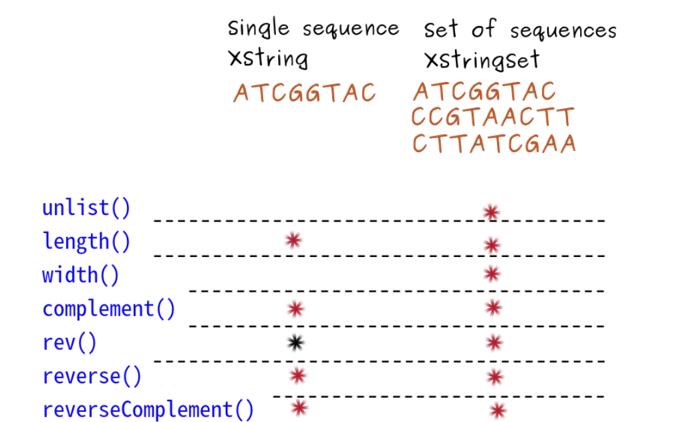

Biological string containers

* Useful because it is memory efficient to store and manipulate sequence of characters
* Containers that can be inherited
For example:
* The BString class comes from big string

Biostring alphabets:

DNA_BASES # DNA 4 bases

[1] "A" "C" "G" "T"

RNA_BASES # RNA 4 Bases

[1] "A" "C" "G" "U"

AA_STANDARD # 20 Amino acids

[1] "A" "R" "N" "D" "C" "Q" "E" "G" "H" "I" 

[11] "L" "K" "M" "F" "P" "S" "T" "W" "Y" "V"

# DNA single string
dna_seq <- DNAString("ATGATCTCGTAA")

dna_seq

12-letter "DNAString" instance

seq: ATGATCTCGTAA

### Subset sequence:
subseq(dnastringobject,start=1 end=10) # takes first 10 nts

## Transcription DNA to RNA string
rna_seq <- RNAString(dna_seq)

rna_seq

12-letter "RNAString" instance 

seq: AUGAUCUCGUAA

## Transcription DNA to RNA

### DNA single string 
dna_seq <- DNAString("ATGATCTCGTAA") 

dna_seq 

12-letter "DNAString" instance 

seq: ATGATCTCGTAA 

## Transcription DNA to RNA string 
rna_seq <- RNAString(dna_seq) 

rna_seq 12

RNA_GENETIC_CODE

rna_seq

12-letter "RNAString" instance 

seq: AUGAUCUCGUAA

### Translation RNA to AA
aa_seq <- translate(rna_seq)

aa_seq

Three RNA bases form one AA: AUG = M, AUC = I, UCG = S, UAA = *

4-letter "AAString" instance

seq: MIS*

## Shortcut translate DNA to amino acids
dna_seq

12-letter "DNAString" instance

seq: ATGATCTCGTAA

### translate() also goes directly from DNA to AA    
translate(dna_seq)

4-letter "AAString" instance

seq: MIS* # Same result as before

# Sequence Handling:

XString to store a single sequence

BString

XStringSet for many sequences (kind of like a list)
BStringSet
DNAStringSet
RNAStringSet
AAStringSet

How do we go from a single sequence to a set and vice versa?
# read the sequence as a set

zikaVirus <- readDNAStringSet("data/zika.fa")
length(zikaVirus)  # the set contains only one sequence
[1] 1
width(zikaVirus)   # and width 10794 bases
[1] 10794

### to collate the sequence use unlist:
zikaVirus_seq <- unlist(zikaVirus)
length(zikaVirus_seq) # A 10794-letter "DNAString" instance
[1] 10794
width(zikaVirus_seq) 
Error unable to find width for "DNAString"

### to create a new set from a single sequence
zikaSet <- DNAStringSet(zikaVirus_seq, 
                        start = c(1, 101, 201), 
                        end = c(100, 200, 300))
zikaSet 
  A DNAStringSet instance of length 3
    width seq
[1]   100 AGTTGTTGATCTGTGTGAGTCAGACT...AATTTGGATTTGGAAACGAGAGTTT
[2]   100 CTGGTCATGAAAAACCCCAAAGAAGA...GTAAACCCCTTGGGAGGTTTGAAGA
[3]   100 GGTTGCCAGCCGGACTTCTGCTGGGT...CAGCAATCAAGCCATCACTGGGCCT

length(zikaSet) 
[1] 3
width(zikaSet) 
[1] 100 100 100

### Complement Sequence:
a_seq <- DNAString("ATGATCTCGTAA")
a_seq
 12-letter "DNAString" instance
seq: ATGATCTCGTAA

complement(a_seq)
 12-letter "DNAString" instance
seq: TACTAGAGCATT

### Reverse using rev() the order of the sequences in the set:
zikaShortSet

 A DNAStringSet instance of length 2
width seq                          names      
[1]    18 AGTTGTTGATCTGTGTGA        seq1
[2]    18 CTGGTCATGAAAAACCCC        seq2

rev(zikaShortSet)

 A DNAStringSet instance of length 2
width seq                          names      
[1]    18 CTGGTCATGAAAAACCCC        seq2       
[2]    18 AGTTGTTGATCTGTGTGA        seq1

### Reverse sequence(s) in a set:
zikaShortSet

 A DNAStringSet instance of length 2
width seq                          names      
[1]    18 AGTTGTTGATCTGTGTGA        seq1
[2]    18 CTGGTCATGAAAAACCCC        seq2

reverse(zikaShortSet)

 A DNAStringSet instance of length 2
width seq                          names    
[1]    18 AGTGTGTCTAGTTGTTGA        seq1
[2]    18 CCCCAAAAAGTACTGGTC        seq2

### Take the reverse complement of sequence:
### Original rna_seq sequence
 8-letter "RNAString" instance
seq: AGUUGUUG

reverseComplement(rna_seq)

  8-letter "RNAString" instance
seq: CAACAACU

###  Using two functions together (less efficient)
reverse(complement(rna_seq))

  8-letter "RNAString" instance
seq: CAACAACU

### Summary:

